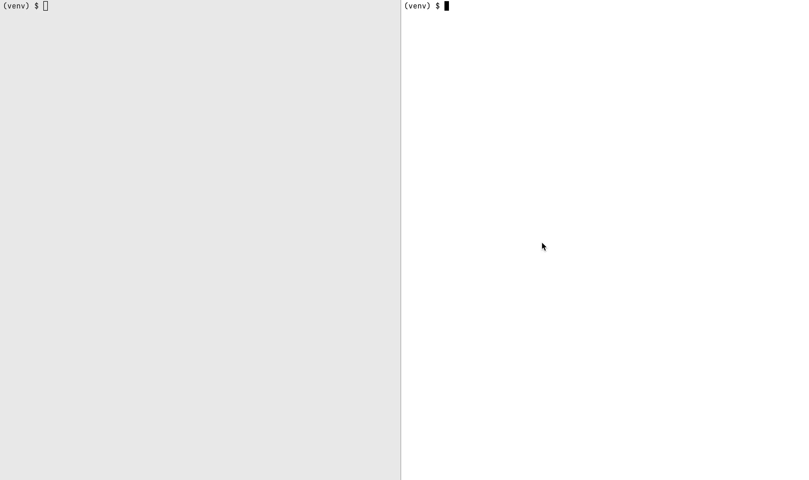

Django SQL Sniffer
==================
A simple command line tool for analyzing Django ORM SQL execution from a running process.
Minimally invasive and granular - no need to change logging config or restart the process.

# Usage
Install though pip
```
pip install django-sql-sniffer
```
Run the tool by passing it a process id which is to be analyzed
```
django-sql-sniffer -p 76441
```
`Ctrl + C` to stop and show the query stats summary. Here's a short demo:

By default, stats summary shows queries sorted by max duration; the possible options include:
- `-t` print queries in tail mode, i.e. as they are executed
- `-c` sort stats summary by query count
- `-s` sort stats summary by total combined query duration
- `-n` set the number of top queries to display in stats summary
- `-v` for verbose logging mode on both the client and server side
- if OS supports `SIGINFO` signal press `Ctrl + T` to display snapshot stats summary without killing the process
# How it works
The tool is composed out of a client and a server. Running `django-sql-sniffer` starts the server, which then 
injects the client into the running process using GDB/LLDB and waits for it to connect. 
The client monkey patches the Django DB cursor and starts streaming queries to the server as they are executed.
The queries are then collected and analyzed on the server side.\
Finally, when the server gets a shutdown signal, it stops the client which in turn rolls back the monkey patch leaving
the target process in the original state.